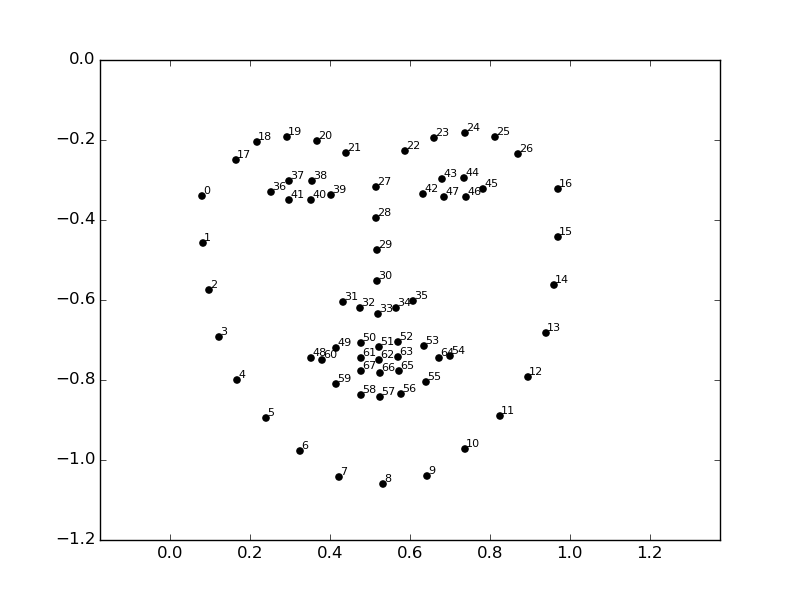
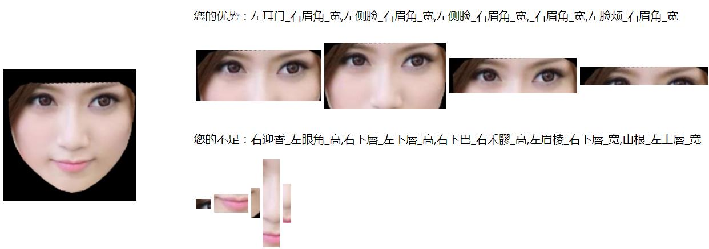
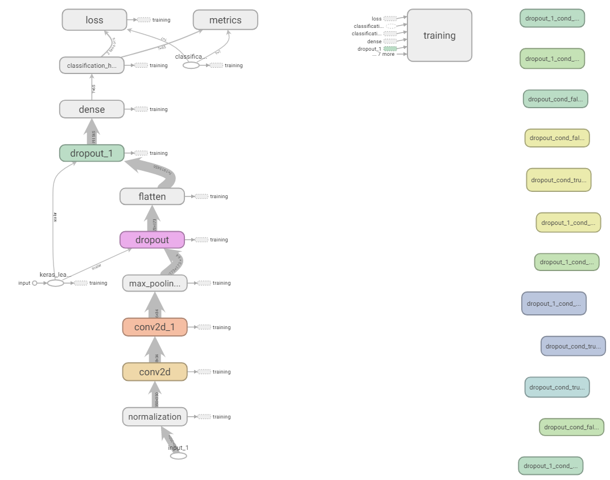

# 爱美丽 Beauty

[简体中文](./readme_cn.md)

## Features

Beauty is an AI drive app that can help user become beautiful.

it contain those functions:

1. face score cheek

2. face beauty report

3. face imporve proposals

4. face comparison ( pk )

right now, it can only support asian women

and other function is under construction

The latest Android Version download:

https://gitee.com/knifecms/beauty/releases

(there is no web connection data transfer, every function works in mobile locally )

| 
 |
 |
 |
|---|---|---|

## Project Introduce

### 1.face contour detection

use Dlib 

### 2.face skin detection

byol + lda

### 3.Overall characteristics

resnet

## Sub projects

1. [android beauty app](./App/readme.md)

2. [deep learning face beauty research](./dl/readme.md)

3. [asian face leaderboard](./leaderboard/readme.md)

## Environment

- Python 3.8

## Usage in python

#### 1.clone:

    git clone https://gitee.com/knifecms/beauty.git

#### 2.Install depend;

##### 2.1 new install:

    conda install cmake
    conda install nodejs
    conda install dlib

##### 2.2 Import conda env：

    conda env create -f face.yaml

#### 3.Modify predict.py image path

    # change the detect image path
    test = "data/2.jpg"

#### 4.Execute:

    python predict.py

    you can get beauty score in [0-5], the higher the better

#### 5.Interpretation of results:

    execute dir landmarks/ 
    
        1_gen_feature.py 
        
        2_prepare_data.py 
        
    gen features in: data/face/features.csv

    then run:
    
    python predict_interpret.py

#### 6.run in cam:

    python predict_cam.py

#### 7.run web service:

    python predict_server.py

    or run:
    
    ./restart_server.sh

preview：

http://locahost:5000/pred

we use two tech to explain result: lime and shap(recommend)

## Questions

1.使用关键点位置判断是否科学？

    关键点位置 + 皮肤 + 配比

2.使用人脸变换(face morph)作为美颜目标是否恰当？

    使用Face Pose Net重建3d人脸

3.检测美是否可以反其道行之，用模型检测丑？

    todo 缺陷检测

## Problems

1.颜值解释运行过于缓慢，需要优化

  已优化(todo 改用集成评估策略)

2.颜值解释说明需要配截图

  已优化

3.需要对人脸校正

  已优化

## Todo

1.尝试使用 MediaPipe 捕获摄像头人脸；

2.尝试使用尺度熵+xgb替换CNN；

3.尝试使用 TFQ 加速模型训练过程；(已应用)

### DEV:

训练数据集：

https://github.com/HCIILAB/SCUT-FBP5500-Database-Release

### 未来计划

1.颜值解释（已添加点位和身体部位对应名称）；
(使用传统切割手段 和 
胶囊图网络Capsule GNN 对比使用 https://github.com/benedekrozemberczki/CapsGNN
 https://github.com/brjathu/deepcaps
 )

2.美肤评测（已添加 lbph 特征）；

3.使用带语义结构的特征（识别特定皮肤纹理等）；

4.使用深度网络对特征进行抽取
（使用autokeras探索SCUT-FBP5500数据集生成模型，仅包含亚洲人和白人）；

5.端上应用：

    由于cordova摄像头插件无法通过录像的方式捕捉人脸轮廓，暂时弃用
    Android Native C++配置过于复杂，windows下与python兼容性不好

## 端上开发

使用 Android Studio 打开 App/beauty

代替 firebase -> 21yunbox.com

## 参考

《女性美容美体小百科》

https://wenku.baidu.com/view/b10e711ba58da0116c1749e6.html

https://wenku.baidu.com/view/29392bbb9fc3d5bbfd0a79563c1ec5da50e2d6eb.html

https://max.book118.com/html/2017/1115/140076049.shtm

## 其他研究进展

https://github.com/bknyaz/beauty_vision

https://github.com/ustcqidi/BeautyPredict

http://antitza.com/assessment_female_beauty.pdf

The Beauty of Capturing Faces: Rating the Quality of Digital Portraits
https://arxiv.org/abs/1501.07304v1

SCUT-FBP5500: A Diverse Benchmark Dataset for Multi-Paradigm Facial Beauty Prediction
https://arxiv.org/abs/1801.06345v1

Understanding Beauty via Deep Facial Features:
https://arxiv.org/pdf/1902.05380.pdf

## 欢迎贡献

欢迎提出宝贵意见及贡献代码

QQ交流群：740807335

加微信进微信群：

开发目录说明：

    App     	移动端项目
    dl          深度神经网络训练过程
    doc         文档
    feature     特征处理
    landmarks   人脸关键点提取过程
    leaderboard 人脸排行榜
    logs        日志目录
    model       模型二进制文件
    static      flask服务静态文件
    template    flask服务模版文件
    test        测试目录
